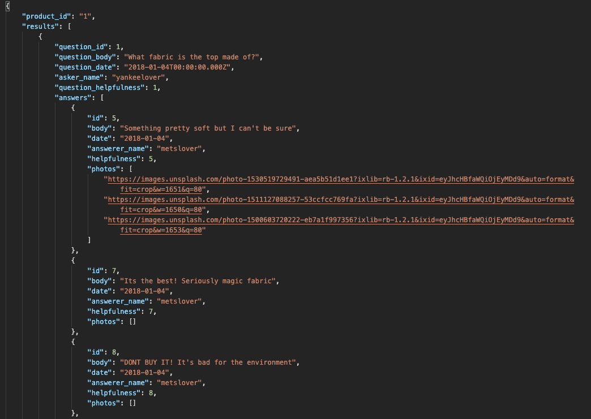
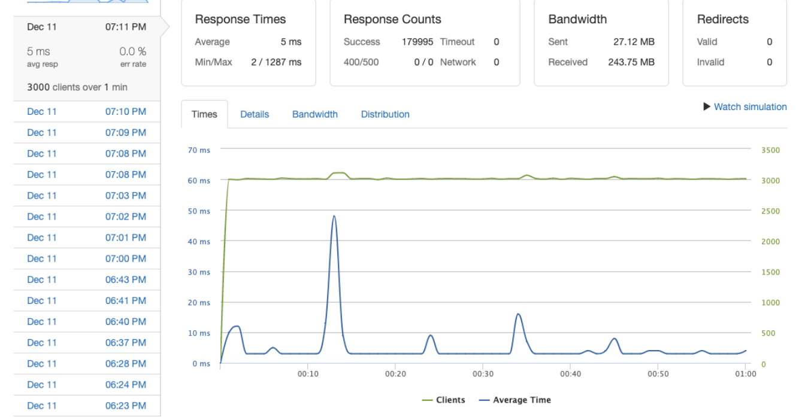

# Project Catwalk - Back-end service for Legacy Front-end Retail Web Application

I was responsible for building out the products Back-end service for the question and answers page.

Performed ETL on 6.5gb of CSV file data. Utilized 3 different schemas to create 3 tables (products, questions, answers). In doing so I created primary and foreign keys to maintain a relationship between the tables. 

Deployed on an AWS EC2 instance using docker and Loader.io, I was able to get 3000 requests per second with 5ms response time.This was done With the use of pooling, indexing, caching, and complex database queries.

## Tech Stack

- [Node](https://nodejs.org/en/)
- [Express](https://expressjs.com/)
- [PostgreSQL](https://www.postgresql.org/)
- [Docker](https://www.docker.com/)
- [AWS](https://aws.amazon.com/)
